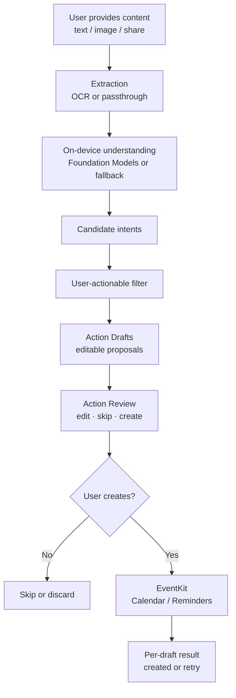
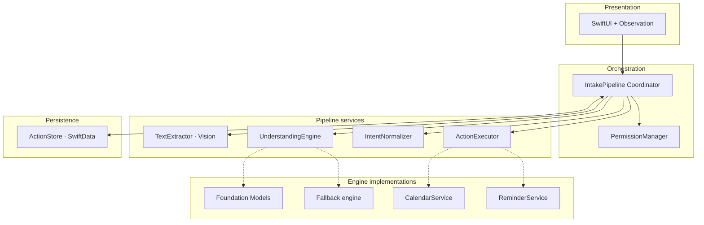

<div align="center">

# Zuvano

**Turn conversation content into Calendar events and Reminders, on-device, with you in control.**

A native iOS app that takes content you provide, understands it privately on-device, and turns useful parts of it into Calendar events and Reminders. You review every proposed action before anything is created.

<br>


<br>

</div>

---

## What is Zuvano?

A lot of useful information gets buried in conversations.

Someone sends you a meeting time. A friend asks you to pick something up on Thursday. A message includes a follow-up task you do not want to forget. The information is already there, but getting it into Calendar or Reminders usually means doing the work yourself.

You read the message, figure out what matters, switch apps, and type everything in again. It is easy to miss something.

Zuvano is built around that small but annoying gap.

You give it the content you want it to look at, either by pasting text, selecting a photo, or using the Share Sheet. Zuvano processes that content on-device and proposes structured **Action Drafts**. You can edit a draft, skip it, or create it.

Nothing is added to Calendar or Reminders just because the model suggested it. The final action is always yours.

Zuvano does not try to be another chatbot or conversation archive. It is a focused pipeline that takes content you choose and helps turn it into native iOS actions.

---

## ✨ Why Zuvano?

There are already plenty of apps that can work with text. The problem is that most of them are solving a different problem.

- **Chatbots and AI assistants** are built around conversation. Zuvano is built around extracting actionable items and getting them into the native apps you already use.
- **Notes and task apps** usually start after you have decided what needs to be saved. Zuvano starts with the conversation itself.
- **Cloud AI wrappers** require sending your content to a remote service. Zuvano's core processing is designed to stay on-device.

The interesting part of Zuvano is the pipeline between understanding something and actually doing something with it:

**conversation → extraction → understanding → intent → user-actionable filter → Action Draft → review → create → native execution**

There is an important boundary in that pipeline:

**AI proposes. You create.**

An extracted intent is not an execution command. An Action Draft is still just a proposal. Calendar or Reminders are only touched after you explicitly choose to create the draft.

The app is also being built with a deliberately small native stack: SwiftUI, Observation, Swift Concurrency, SwiftData, Vision, Foundation Models, and EventKit.

---

## 🚧 Project Status

Zuvano is **under active development** as part of **ACoding Hackathon 2026**.

**Day 0 (2026-09-17) is complete.** The product definition, architecture, data model, feature specification, technical decisions, and UI/UX instructions are in place. The actual iOS implementation has not started yet, so there is no Xcode project or Swift source in this repository at the moment.

| Area | Status | Notes |
|---|---|---|
| Product definition | ✅ Complete | `docs/00_PROJECT_CONTEXT.md`, `docs/01_PRODUCT_SPEC.md` |
| Feature specification | ✅ Complete | `docs/04_FEATURE_SPEC.md` |
| System architecture | ✅ Complete | `docs/02_SYSTEM_ARCHITECTURE.md` |
| Data model | ✅ Complete | `docs/03_DATA_MODEL.md` |
| Technical decisions | ✅ Complete | `docs/05_TECHNICAL_DECISIONS.md` |
| UI/UX specification | ✅ Complete | `docs/UI_UX_INSTRUCTIONS.md` |
| Implementation roadmap | ✅ Complete | `docs/7_DAY_BUILD_ROADMAP.md` |
| Build-in-public logs | 🟡 Started | `docs/build-log/DAY_00_2026-09-17.md` |
| iOS app / Xcode project | ⬜ Not started | Planned Day 1+ |
| Core pipeline (OCR, understanding, drafts) | ⬜ Planned | Days 2–4 |
| EventKit execution | ⬜ Planned | Day 5 |
| Share Extension | ⬜ Planned | Day 6 |
| Automated tests | ⬜ Planned | Throughout roadmap |
| App Store readiness | ⬜ Not started | Post-hackathon scope |

Some platform details still need SDK or device validation, especially Foundation Models APIs, structured output, OCR quality on real screenshots, and the Share Extension handoff experience.

---

## 🧠 How It Works

For each piece of content, Zuvano follows the same basic pipeline:



The important part is what happens between the model and EventKit.

AI output is treated as input to the system, not as permission to perform an action. Zuvano filters the extracted intents, turns the ones that are actually actionable into drafts, and puts those drafts in front of you for review.

For example, a single chat message might contain a meeting, a reminder, and a task. Zuvano can turn those into separate drafts so you can decide what to keep and what to ignore.

---

## 🏗️ Architecture

Zuvano uses a **modular pipeline coordinated by a single orchestrator**. The structure is intentionally small enough to build during a hackathon while keeping clear boundaries around the parts that need testing and safety.



### Major components

| Component | Responsibility |
|---|---|
| **Presentation** | SwiftUI views render state and forward user actions. Business logic stays out of the views. |
| **IntakePipeline Coordinator** | Drives the pipeline lifecycle, applies the user-actionable filter, creates Action Drafts, and coordinates review, creation, and execution. |
| **TextExtractor** | Passes through text and uses Vision OCR for images. Temporary image data is retained until OCR succeeds. |
| **UnderstandingEngine** | Extracts candidate intents from text. The primary path uses on-device Foundation Models, with a deterministic fallback. |
| **IntentNormalizer** | Resolves relative dates, times, and entities while preserving ambiguity. It does not create drafts. |
| **ActionExecutor** | Creates Calendar events or Reminders after the user chooses create. |
| **PermissionManager** | Requests Calendar or Reminders access only when it is actually needed. |
| **ActionStore** | Uses SwiftData to persist in-flight Intakes and Action Drafts for review, retry, and execution recovery. It is not a conversation archive. |

### Important design decisions

- **Intake processing is separate from draft execution.** Intake state covers ingestion through ready-for-review. Confirmation and EventKit state belong to Action Drafts.
- **Intent and Action Draft are different things.** Only user-actionable intents become drafts. Questions, historical statements, and commitments belonging to someone else should not become user actions.
- **Retries start from the failed stage.** A failed OCR step should not require rerunning the entire pipeline. The same applies to understanding, draft generation, and individual EventKit operations.
- **Execution is designed to be idempotent.** The app persists `executing` before calling EventKit and stores the resulting `nativeIdentifier` after success. Recovery does not blindly execute an action again.
- **Sensitive content stays in-flight.** The app is designed to purge sensitive text after terminal completion or discard rather than turning it into a permanent conversation archive.

More detail is available in [`docs/02_SYSTEM_ARCHITECTURE.md`](docs/02_SYSTEM_ARCHITECTURE.md), [`docs/03_DATA_MODEL.md`](docs/03_DATA_MODEL.md), and [`docs/05_TECHNICAL_DECISIONS.md`](docs/05_TECHNICAL_DECISIONS.md).

---

## 🛠️ Tech Stack

The target application is built around Apple's native frameworks.

The Xcode project and Swift source are **not in the repository yet**. This is the stack defined by the current technical decisions and will be validated as implementation begins.

| Technology | Purpose |
|---|---|
| **Swift** | Application language |
| **SwiftUI** | Native iPhone UI |
| **Observation** (`@Observable`) | Reactive UI and orchestrator state |
| **Swift Concurrency** | Async pipeline and Swift 6 strict concurrency |
| **SwiftData** | In-flight Intake and Action Draft persistence |
| **Vision** | On-device OCR for conversation screenshots |
| **Foundation Models** (iOS 26+) | Primary on-device understanding |
| **EventKit** | Calendar events and Reminders after user confirmation |
| **PhotosPicker** | Image import without broad photo-library permission |

**Out of scope for the MVP:** third-party dependencies, external LLM APIs, backend services, UIKit-first architecture, DI frameworks, and event buses.

Deployment target: **iOS 26.0** minimum. Development and testing target: **iOS 27**.

---

## 📁 Project Structure

```text
Zuvano/
├── README.md                          # This file
├── skills-lock.json                   # Installed Cursor agent skills lockfile
├── .agents/
│   └── skills/                        # Project-local agent skills
├── .cursor/
│   ├── agents/
│   │   └── ios-design-reviewer.md     # UI/UX review subagent for Zuvano
│   └── rules/
│       └── zuvano-build-workflow.mdc  # Build-in-public / daily workflow rules
└── docs/
    ├── 00_PROJECT_CONTEXT.md          # Master product context
    ├── 01_PRODUCT_SPEC.md             # Product requirements
    ├── 02_SYSTEM_ARCHITECTURE.md      # Technical architecture
    ├── 03_DATA_MODEL.md               # Entities, states, lifecycle
    ├── 04_FEATURE_SPEC.md             # Behavioral specification (F1–F14)
    ├── 05_TECHNICAL_DECISIONS.md      # Accepted technical decisions (TD-01–TD-22)
    ├── UI_UX_INSTRUCTIONS.md          # UI/UX implementation specification
    ├── 7_DAY_BUILD_ROADMAP.md         # Day-by-day implementation plan
    ├── BUILD_LOG_TEMPLATE.md          # Template for daily build logs
    ├── SETUP_README.md                # Cursor / build-in-public setup notes
    └── build-log/
        └── DAY_00_2026-09-17.md       # Day 0 build log
```

There is **no `Zuvano/` app target directory yet**. The Xcode project and Swift sources will be added during implementation, starting on Day 1.

---

## 📚 Documentation

If you are new to the project, start here:

1. [`docs/00_PROJECT_CONTEXT.md`](docs/00_PROJECT_CONTEXT.md) — what Zuvano is and is not
2. [`docs/01_PRODUCT_SPEC.md`](docs/01_PRODUCT_SPEC.md) — requirements and MVP scope
3. [`docs/04_FEATURE_SPEC.md`](docs/04_FEATURE_SPEC.md) — feature behavior
4. [`docs/02_SYSTEM_ARCHITECTURE.md`](docs/02_SYSTEM_ARCHITECTURE.md) — system design
5. [`docs/03_DATA_MODEL.md`](docs/03_DATA_MODEL.md) — data model and state machines
6. [`docs/05_TECHNICAL_DECISIONS.md`](docs/05_TECHNICAL_DECISIONS.md) — technology choices
7. [`docs/UI_UX_INSTRUCTIONS.md`](docs/UI_UX_INSTRUCTIONS.md) — UI/UX specification

The implementation plan is in [`docs/7_DAY_BUILD_ROADMAP.md`](docs/7_DAY_BUILD_ROADMAP.md).

Daily progress is recorded in [`docs/build-log/`](docs/build-log/).

---

## 🗺️ Roadmap

| Day | Focus |
|---|---|
| **0** ✅ | Product, architecture, data model, UI/UX — complete |
| **1** | Xcode project, SwiftUI app shell, Home / Capture |
| **2** | Intake, OCR, extraction pipeline |
| **3** | On-device understanding, intent extraction, user-actionable filter |
| **4** | Action Drafts, Action Review |
| **5** | EventKit execution, permissions, recovery |
| **6** | Share Extension, polish, QA |
| **7** | Demo hardening, build-in-public wrap-up |

See [`docs/7_DAY_BUILD_ROADMAP.md`](docs/7_DAY_BUILD_ROADMAP.md) for the full definitions of done and verification criteria.

---

## 🔒 Privacy

Privacy is part of the architecture, not a separate feature added later.

- Conversation content is processed **on-device**. Zuvano does not send it to a backend or external LLM.
- The core flow does not use API keys or telemetry.
- Raw images are kept only until OCR succeeds.
- Extracted text is kept while it is needed for review and retry, then purged. It is not stored as a browsable conversation archive.
- Calendar and Reminder items created through EventKit can sync through the user's Apple accounts in the normal way.

More detail is in [`docs/00_PROJECT_CONTEXT.md`](docs/00_PROJECT_CONTEXT.md) §15 and [`docs/01_PRODUCT_SPEC.md`](docs/01_PRODUCT_SPEC.md) §21.

---

## 🚫 What Zuvano Is Not

Zuvano is not trying to replace your messaging app, notes app, task manager, or calendar.

It is also not a chatbot, conversation archive, memory system, background monitor, or cloud AI wrapper.

Zuvano does not read private conversations from other apps. It does not scrape messages. It does not automatically execute an action because an AI model suggested one.

The user chooses the content, reviews the proposed actions, and decides what gets created.

---

## 🛠️ Getting Started

> **Note:** The runnable iOS app is not in this repository yet. Implementation starts on Day 1.

### Requirements

The planned development setup is:

- Xcode with an iOS 26+ SDK
- iPhone Simulator or a physical iPhone
- A device with Foundation Models availability for full understanding tests
- macOS for Share Extension development

### When the Xcode project is added

1. Open the project in Xcode.
2. Select an iPhone Simulator or connected device running iOS 26+.
3. Build and run.

The `docs/` specification set is the source of truth for implementation. If two documents disagree, use this resolution order:

**Product → Feature → Architecture → Technical decisions → UI/UX instructions**

---

## 📣 Build in Public

Zuvano is being built in public during **ACoding Hackathon 2026**.

The daily build logs in [`docs/build-log/`](docs/build-log/) record what was actually worked on each day. The idea is simple: build the app, document the decisions, share the progress, and show what happens during the hackathon rather than only posting the finished result.

**Day 0** was about getting the foundation right before writing the first line of app code.

---

## 🏷️ Hackathon

**ACoding Hackathon 2026** · Native iOS · iPhone · On-device AI · Human-in-the-loop actions
