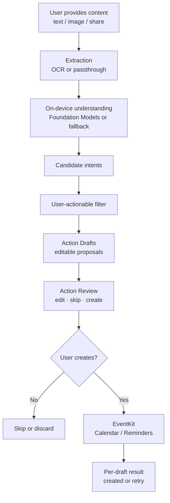
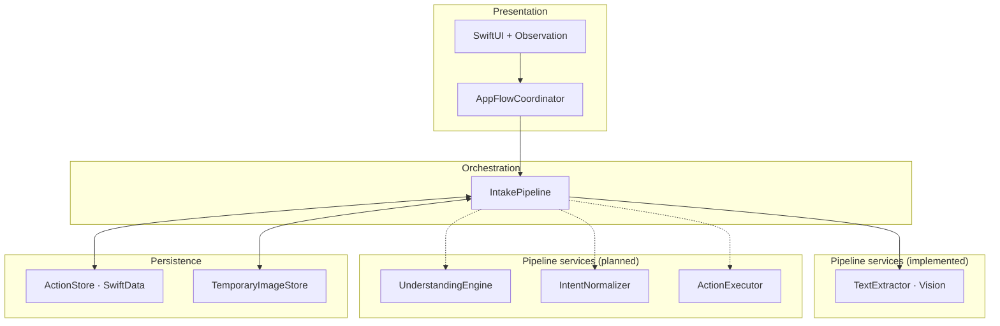

<div align="center">

# Zuvano

**Turn conversation content into Calendar events and Reminders, on-device, with you in control.**

A native iOS app that takes content you provide, understands it privately on-device, and turns useful parts of it into Calendar events and Reminders. You review every proposed action before anything is created.

<br>


<br>

</div>

---

## What is Zuvano?

A lot of useful information gets buried in conversations.

Someone sends you a meeting time. A friend asks you to pick something up on Thursday. A message includes a follow-up task you do not want to forget. The information is already there, but getting it into Calendar or Reminders usually means doing the work yourself.

You read the message, figure out what matters, switch apps, and type everything in again. It is easy to miss something.

Zuvano is built around that small but annoying gap.

You give it the content you want it to look at, either by pasting text, selecting a photo, or using the Share Sheet. Zuvano processes that content on-device and proposes structured **Action Drafts**. You can edit a draft, skip it, or create it.

Nothing is added to Calendar or Reminders just because the model suggested it. The final action is always yours.

Zuvano does not try to be another chatbot or conversation archive. It is a focused pipeline that takes content you choose and helps turn it into native iOS actions.

---

## ✨ Why Zuvano?

There are already plenty of apps that can work with text. The problem is that most of them are solving a different problem.

- **Chatbots and AI assistants** are built around conversation. Zuvano is built around extracting actionable items and getting them into the native apps you already use.
- **Notes and task apps** usually start after you have decided what needs to be saved. Zuvano starts with the conversation itself.
- **Cloud AI wrappers** require sending your content to a remote service. Zuvano's core processing is designed to stay on-device.

The interesting part of Zuvano is the pipeline between understanding something and actually doing something with it:

**conversation → extraction → understanding → intent → user-actionable filter → Action Draft → review → create → native execution**

There is an important boundary in that pipeline:

**AI proposes. You create.**

An extracted intent is not an execution command. An Action Draft is still just a proposal. Calendar or Reminders are only touched after you explicitly choose to create the draft.

The app is also being built with a deliberately small native stack: SwiftUI, Observation, Swift Concurrency, SwiftData, Vision, Foundation Models, and EventKit.

---

## 🚧 Project Status

Zuvano is **under active development** as part of **ACoding Hackathon 2026**.

**Days 0–2 are complete.** The spec is frozen, the Xcode project exists, and the intake + OCR pipeline is wired end-to-end through extraction. Understanding, Action Drafts, EventKit, and the Share Extension are not built yet.

| Area | Status | Notes |
|---|---|---|
| Product definition | ✅ Complete | `docs/00_PROJECT_CONTEXT.md`, `docs/01_PRODUCT_SPEC.md` |
| Feature specification | ✅ Complete | `docs/04_FEATURE_SPEC.md` |
| System architecture | ✅ Complete | `docs/02_SYSTEM_ARCHITECTURE.md` |
| Data model | ✅ Complete | `docs/03_DATA_MODEL.md` |
| Technical decisions | ✅ Complete | `docs/05_TECHNICAL_DECISIONS.md` |
| UI/UX specification | ✅ Complete | `docs/UI_UX_INSTRUCTIONS.md` |
| Implementation roadmap | ✅ Complete | `docs/7_DAY_BUILD_ROADMAP.md` |
| Build-in-public logs | 🟡 In progress | `docs/build-log/` (Days 0–2) |
| iOS app / Xcode project | ✅ Day 1 | `Zuvano/Zuvano.xcodeproj` |
| Home / Capture (S1) | ✅ Day 1 | Paste, Choose Photo, Enter Text |
| Intake + OCR pipeline | ✅ Day 2 | SwiftData, Vision OCR, processing + failure UI |
| On-device understanding | ⬜ Planned | Day 3 |
| Action Drafts + Review | ⬜ Planned | Day 4 |
| EventKit execution | ⬜ Planned | Day 5 |
| Share Extension | ⬜ Planned | Day 6 |
| Automated tests | 🟡 Started | 9 pipeline unit tests + template UI tests |
| App Store readiness | ⬜ Not started | Post-hackathon scope |

### What works today (Day 2)

- **Paste** authorized text via system `UIPasteControl` (no direct clipboard reads)
- **Choose Photo** via `PhotosPicker` starts image intake
- **Enter Text** manual entry from Home
- **Processing** screen with phase-aware copy
- **Vision OCR** for screenshots (unit-tested with stubs; real-device quality not formally benchmarked)
- **OCR failure** recovery: Try Again, Enter Text, Discard
- **Extraction Complete** milestone screen showing extracted text (temporary until Day 3 understanding)
- **Launch recovery** for interrupted intakes
- **9 Swift Testing** cases for pipeline, retry, recovery, and temp file cleanup

### Not built yet

Understanding engine, intent extraction, user-actionable filter, Action Drafts, Action Review, EventKit create flow, Share Extension.

---

## 🧠 How It Works

For each piece of content, Zuvano follows the same basic pipeline:



**Current implementation stops after extraction.** Successful OCR advances persistence to `.understanding`, but the understanding engine is Day 3 work. The Extraction Complete screen is a temporary milestone to verify extracted text.

The important part is what happens between the model and EventKit.

AI output is treated as input to the system, not as permission to perform an action. Zuvano filters the extracted intents, turns the ones that are actually actionable into drafts, and puts those drafts in front of you for review.

---

## 🏗️ Architecture

Zuvano uses a **modular pipeline coordinated by a single orchestrator**. The structure is intentionally small enough to build during a hackathon while keeping clear boundaries around the parts that need testing and safety.



### Major components

| Component | Responsibility | Status |
|---|---|---|
| **Presentation** | SwiftUI views render state; `AppFlowCoordinator` owns flow | ✅ |
| **IntakePipeline** | Import → extract → persist; retry, manual fallback, discard, recovery | ✅ |
| **TextExtractor** | Passthrough text + Vision OCR for images | ✅ |
| **ActionStore** | SwiftData `@ModelActor` for in-flight Intake state | ✅ |
| **TemporaryImageStore** | Temp image files per data model rules | ✅ |
| **UnderstandingEngine** | On-device intent extraction | ⬜ Day 3 |
| **ActionExecutor** | EventKit create after user confirmation | ⬜ Day 5 |
| **PermissionManager** | Calendar/Reminders access when needed | ⬜ Day 5 |

### Important design decisions

- **Intake processing is separate from draft execution.** Intake state covers ingestion through ready-for-review. Confirmation and EventKit state belong to Action Drafts.
- **Intent and Action Draft are different things.** Only user-actionable intents become drafts.
- **Retries start from the failed stage.** OCR, understanding, draft generation, and EventKit each have their own retry boundary.
- **Paste uses system authorization.** iOS 16+ blocks direct `UIPasteboard` reads. Paste must go through a visible `UIPasteControl`.
- **Sensitive content stays in-flight.** Purged after terminal completion or discard, not stored as a conversation archive.

More detail: [`docs/02_SYSTEM_ARCHITECTURE.md`](docs/02_SYSTEM_ARCHITECTURE.md), [`docs/03_DATA_MODEL.md`](docs/03_DATA_MODEL.md), [`docs/05_TECHNICAL_DECISIONS.md`](docs/05_TECHNICAL_DECISIONS.md).

---

## 🛠️ Tech Stack

| Technology | Purpose | In use |
|---|---|---|
| **Swift 6** | Application language, strict concurrency | ✅ |
| **SwiftUI** | Native iPhone UI | ✅ |
| **Observation** (`@Observable`) | `AppFlowCoordinator` state | ✅ |
| **Swift Concurrency** | Async pipeline, `@ModelActor` | ✅ |
| **SwiftData** | In-flight Intake persistence | ✅ |
| **Vision** | On-device OCR (`VNRecognizeTextRequest`) | ✅ |
| **UIKit** | `UIPasteControl` for authorized paste | ✅ |
| **Foundation Models** (iOS 26+) | On-device understanding | ⬜ Day 3 |
| **EventKit** | Calendar / Reminders after confirmation | ⬜ Day 5 |
| **PhotosPicker** | Image import | ✅ |

**Out of scope for the MVP:** third-party dependencies, external LLM APIs, backend services.

Deployment target: **iOS 26.0** minimum. Development and testing target: **iOS 27**.

---

## 📁 Project Structure

```text
Zuvano/
├── README.md
├── Zuvano/
│   ├── Zuvano.xcodeproj
│   ├── Zuvano/
│   │   ├── App/                    # ZuvanoApp entry point
│   │   ├── Domain/                 # Source, IntakeSnapshot, pipeline enums
│   │   ├── Extraction/             # TextExtracting, VisionTextExtractor
│   │   ├── Orchestration/          # IntakePipeline
│   │   ├── Persistence/            # IntakeRecord, ActionStore, TemporaryImageStore
│   │   ├── Features/
│   │   │   ├── App/                # AppFlowCoordinator, RootView
│   │   │   ├── Home/               # HomeView, ZuvanoPasteControl
│   │   │   ├── Processing/         # S2 Processing
│   │   │   ├── PipelineFailure/    # S7 failure + retry
│   │   │   ├── ManualTextEntry/      # OCR fallback text entry
│   │   │   └── ExtractionComplete/ # Day 2 milestone (temporary)
│   │   └── DesignSystem/           # Colors, typography, spacing
│   ├── ZuvanoTests/                # Swift Testing (pipeline + extraction)
│   └── ZuvanoUITests/              # Template UI tests
├── docs/                           # Frozen spec set + roadmap + build logs
│   ├── 00_PROJECT_CONTEXT.md
│   ├── 01_PRODUCT_SPEC.md
│   ├── 02_SYSTEM_ARCHITECTURE.md
│   ├── 03_DATA_MODEL.md
│   ├── 04_FEATURE_SPEC.md
│   ├── 05_TECHNICAL_DECISIONS.md
│   ├── UI_UX_INSTRUCTIONS.md
│   ├── 7_DAY_BUILD_ROADMAP.md
│   └── build-log/
│       ├── DAY_00_2026-09-17.md
│       ├── DAY_01_2026-09-18.md
│       └── DAY_02_2026-09-18.md
├── .agents/skills/                 # Project-local agent skills
└── .cursor/rules/                  # Build workflow rules
```

---

## 📚 Documentation

If you are new to the project, start here:

1. [`docs/00_PROJECT_CONTEXT.md`](docs/00_PROJECT_CONTEXT.md) — what Zuvano is and is not
2. [`docs/01_PRODUCT_SPEC.md`](docs/01_PRODUCT_SPEC.md) — requirements and MVP scope
3. [`docs/04_FEATURE_SPEC.md`](docs/04_FEATURE_SPEC.md) — feature behavior
4. [`docs/02_SYSTEM_ARCHITECTURE.md`](docs/02_SYSTEM_ARCHITECTURE.md) — system design
5. [`docs/03_DATA_MODEL.md`](docs/03_DATA_MODEL.md) — data model and state machines
6. [`docs/05_TECHNICAL_DECISIONS.md`](docs/05_TECHNICAL_DECISIONS.md) — technology choices
7. [`docs/UI_UX_INSTRUCTIONS.md`](docs/UI_UX_INSTRUCTIONS.md) — UI/UX specification

Implementation plan: [`docs/7_DAY_BUILD_ROADMAP.md`](docs/7_DAY_BUILD_ROADMAP.md)

Daily progress: [`docs/build-log/`](docs/build-log/)

---

## 🗺️ Roadmap

| Day | Focus | Status |
|---|---|---|
| **0** | Product, architecture, data model, UI/UX | ✅ Complete |
| **1** | Xcode project, SwiftUI app shell, Home / Capture | ✅ Complete |
| **2** | Intake, OCR, extraction pipeline | ✅ Complete |
| **3** | On-device understanding, intent extraction, user-actionable filter | ⬜ Next |
| **4** | Action Drafts, Action Review | ⬜ Planned |
| **5** | EventKit execution, permissions, recovery | ⬜ Planned |
| **6** | Share Extension, polish, QA | ⬜ Planned |
| **7** | Demo hardening, build-in-public wrap-up | ⬜ Planned |

See [`docs/7_DAY_BUILD_ROADMAP.md`](docs/7_DAY_BUILD_ROADMAP.md) for definitions of done and verification criteria.

---

## 🔒 Privacy

Privacy is part of the architecture, not a separate feature added later.

- Conversation content is processed **on-device**. Zuvano does not send it to a backend or external LLM.
- The core flow does not use API keys or telemetry.
- Raw images are kept only until OCR succeeds.
- Extracted text is kept while it is needed for review and retry, then purged. It is not stored as a browsable conversation archive.
- Paste uses Apple's `UIPasteControl`. Clipboard content is only read after you tap Paste and iOS authorizes access.
- Calendar and Reminder items created through EventKit can sync through the user's Apple accounts in the normal way.

More detail: [`docs/00_PROJECT_CONTEXT.md`](docs/00_PROJECT_CONTEXT.md) §15, [`docs/01_PRODUCT_SPEC.md`](docs/01_PRODUCT_SPEC.md) §21.

---

## 🚫 What Zuvano Is Not

Zuvano is not trying to replace your messaging app, notes app, task manager, or calendar.

It is also not a chatbot, conversation archive, memory system, background monitor, or cloud AI wrapper.

Zuvano does not read private conversations from other apps. It does not scrape messages. It does not automatically execute an action because an AI model suggested one.

The user chooses the content, reviews the proposed actions, and decides what gets created.

---

## 🛠️ Getting Started

### Requirements

- Xcode with iOS 26+ SDK (iOS 27 recommended for development)
- iPhone Simulator or physical iPhone running iOS 26+

### Build and run

```bash
cd Zuvano
open Zuvano.xcodeproj
```

Select an iPhone Simulator (or a connected device), then **Product → Run** (⌘R).

### Run tests

```bash
cd Zuvano
xcodebuild -scheme Zuvano \
  -destination 'platform=iOS Simulator,name=iPhone 18 Pro' \
  test
```

Or run **ZuvanoTests** from Xcode (⌘U).

### Source of truth

The `docs/` specification set governs implementation. If two documents disagree, use this resolution order:

**Product → Feature → Architecture → Technical decisions → UI/UX instructions**

---

## 📣 Build in Public

Zuvano is being built in public during **ACoding Hackathon 2026**.

Daily build logs in [`docs/build-log/`](docs/build-log/) record what was actually worked on each day.

| Day | Summary |
|---|---|
| **0** | Froze product spec, architecture, data model, UI/UX |
| **1** | Xcode project, SwiftUI Home shell, design system |
| **2** | Intake + SwiftData + Vision OCR pipeline, processing/failure UI, authorized paste |

---

## 🏷️ Hackathon

**ACoding Hackathon 2026** · Native iOS · iPhone · On-device AI · Human-in-the-loop actions
