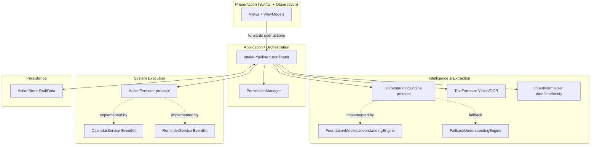

# Zuvano: System Architecture

> Authoritative technical architecture for: **Conversation → Extraction → Understanding → Intent → User-actionable filter → Action Draft → Review → Explicit Confirmation → Native Execution → Result.**
>
> Product requirements: [Product Specification](./01_PRODUCT_SPEC.md). Behavior: [Feature Specification](./04_FEATURE_SPEC.md). Types: [Data Model](./03_DATA_MODEL.md). Rationale: [Technical Decisions](./05_TECHNICAL_DECISIONS.md).

---

## 1. Architecture Goals

- Implement the conversation→action loop cleanly and safely.
- Keep the human in the loop: AI proposes, user confirms, system executes.
- On-device, local-first, offline-capable.
- Buildable in a hackathon: one orchestrator, focused services, native APIs, no DI framework, no event bus, no extra Clean Architecture layers.
- Testable without live AI or real Calendar access.
- Extensible later (App Intents, new action kinds) without rewriting the loop.

## 2. Architectural Principles

1. **Unidirectional dependencies** toward domain types; no layer reaches past its neighbor.
2. **No business logic in SwiftUI views.** Views render state and forward user actions.
3. **SwiftUI never talks to EventKit/Vision/Foundation Models directly.** It goes through the orchestrator.
4. **AI is behind a protocol** so it can be mocked, replaced, or made to fail deterministically.
5. **Proposals are not executions.** Only confirmed ActionDrafts may reach `ActionExecutor`.
6. **An Intent is not an ActionDraft.** The orchestrator filters for user-actionable intents, then creates drafts.
7. **Intake does not execute.** Confirmation and EventKit state live on ActionDrafts.
8. **Fail safe.** Any failure leaves needed content intact and retryable from the failed stage.
9. **Do not over-engineer.** Protocol seams only where they earn their keep (`UnderstandingEngine`, `ActionExecutor`).

## 3. High-Level Architecture



## 4. Architecture Diagram (Core Loop)

```mermaid
sequenceDiagram
    participant U as User
    participant V as Presentation
    participant O as Orchestrator
    participant T as TextExtractor
    participant E as UnderstandingEngine
    participant N as Normalizer
    participant S as ActionStore
    participant X as ActionExecutor

    U->>V: provide content
    V->>O: start intake(source)
    O->>T: extract text
    T-->>O: ExtractedText
    O->>S: persist extractedText; drop image
    O->>E: understand(text)
    E-->>O: [Intent] candidates
    O->>O: user-actionable filter
    O->>N: normalize(filtered intents, now)
    N-->>O: intents with dates/entities
    O->>O: map to ActionDrafts
    O->>S: persist drafts (pending, notStarted)
    O-->>V: readyForReview
    U->>V: edit / confirm / reject per draft
    V->>O: confirm(draft) after validation
    O->>S: persist executing
    O->>X: execute(confirmed draft)
    X-->>O: result per action
    O->>S: update executed/failed + nativeId
    O-->>V: show per-draft results
```

## 5. Module Boundaries

| Module | Responsibility |
|---|---|
| **Presentation** | SwiftUI views + view models; render state, forward user actions |
| **Orchestration** | Drive the pipeline; user-actionable filter; create ActionDrafts; confirm/execute coordination; launch recovery |
| **Ingestion** | Receive image/text/share content (in-app + Share Extension capture) |
| **Text Extraction** | OCR images; pass through text |
| **Intelligence** | Understand text, extract candidate intents & entities (`UnderstandingEngine`) |
| **Normalization** | Convert relative dates/entities → structured values + ambiguity. **Does not create ActionDrafts.** |
| **Execution** | Create Calendar events / Reminders via EventKit (`ActionExecutor`) |
| **Permissions** | Request/report Calendar/Reminder access |
| **Persistence** | Persist in-flight Intake & ActionDrafts (SwiftData) + temp files |
| **Domain** | Value types, enums, state machines (no framework deps) |

## 6. Dependency Direction

```
Presentation → Orchestration → { Intelligence, Extraction, Normalization, Execution, Permissions, Persistence }
```

Domain types have **no outward dependencies**. Concrete implementations (Foundation Models, EventKit, Vision, SwiftData) sit at the edges and are constructed into the orchestrator. No DI container.

## 7. Input / Ingestion Layer

**Where:** Presentation + a Share Extension target.

- In-app: paste text; pick an image (PhotosUI) or accept a dropped/shared item.
- Share Extension: accepts text and image UTTypes; **capture + handoff only** (see §20).
- All inputs become a unified `Source` before entering the pipeline.

## 8. Content Extraction Layer

**Where:** `TextExtractor`.

- Text source → passes text through unchanged.
- Image source → routes to OCR.
- Unsupported type → pipeline `failed` with `unsupportedInput`.

## 9. OCR Layer

**Where:** `TextExtractor` using **Vision** (text recognition). VisionKit may be used for capture UX where appropriate. *REQUIRES SDK VALIDATION* for exact API choices.

- Input: image. Output: `ExtractedText` (string + confidence signal where available).
- On OCR failure or empty result → `ocrFailed`, `failedStage = extraction`; retain temp image for retry or manual entry.
- On success → persist `extractedText`, discard the image. Later failures do not need the image.

## 10. AI Understanding Layer

**Where:** `UnderstandingEngine` protocol.

```
protocol UnderstandingEngine {
    func understand(_ text: String) async throws -> UnderstandingResult
}
```

- **Primary:** `FoundationModelsUnderstandingEngine`: Apple Foundation Models (iOS 26+), runtime-gated on the **installed SDK's availability API** (name not frozen here). Uses structured output if the SDK provides it, then **validates** against the Intent schema. *REQUIRES SDK VALIDATION* for availability API, structured-output/tool API, and token limits.
- **Fallback:** `FallbackUnderstandingEngine`: deterministic, non-AI. Does **not** fabricate intent. Yields a minimal safe result, a manual-entry scaffold, or zero intents, marked low confidence.
- **Selection:** orchestrator: if primary unavailable or throws → fallback. If fallback cannot produce a safe result → Intake `failed`, `failedStage = understanding`. Retry understanding, not OCR.
- AI output is **never executed**. It is not even drafted until the user-actionable filter runs.

## 11. Intent Extraction Layer

Part of `UnderstandingEngine` output: a list of candidate `Intent` values (kind, source phrase, entities, confidence, ambiguous). Prompt/system instructions encode [Product Spec §9](./01_PRODUCT_SPEC.md). This layer does **not** create ActionDrafts.

## 12. Entity Extraction / Normalization

**Where:** `IntentNormalizer`.

- Resolves relative date/time expressions ("Friday", "tomorrow", "around 7", "next week") against a provided `Date`.
- Preserves the **original expression** and the **normalized value** separately.
- Marks ambiguous values instead of hiding them. A proposed ~7:00 PM is an approximation (`startDate` set, `ambiguous == true`), not a missing value.
- Must not silently invent a calendar start when none can be proposed; leave `startDate` nil.
- Handles locations and people as entities.
- Pure and deterministic given a `Date` → unit-testable.
- **Returns normalized Intents (or date/entity updates). Does not return `[ActionDraft]`.**

## 13. Action Draft Generation

The **orchestrator**:

1. Applies the user-actionable filter ([Data Model §8](./03_DATA_MODEL.md)).
2. Asks the Normalizer to resolve entities/dates on remaining intents.
3. Maps remaining intents to `ActionDraft` (`pending`, `notStarted`).
4. Persists drafts; sets Intake `readyForReview` even when the list is empty.

Follow-up mapping is SHOULD-HAVE and not required here.

## 14. Validation

Before `confirmationState = confirmed`, each draft is validated ([Data Model §10](./03_DATA_MODEL.md)): title; Calendar `when.startDate`; supported `actionKind`. Invalid → stay pending, no EventKit.

## 15. Review State

The orchestrator exposes Intake `readyForReview` plus each draft's confirmation/execution/ambiguity fields. Presentation may use a local UI `idle` when no intake is active; that is **not** a persisted `ProcessingState`. No execution happens in review.

## 16. Confirmation

- Explicit user action per draft (or selected subset).
- Orchestrator validates, then sets `.confirmed`. Request permission before persist-`executing`. Then execute **that** draft.
- **No execution without `.confirmed`.** Intake state is not an execution gate.

## 17. Native Action Execution

**Where:** `ActionExecutor` protocol, implemented by `CalendarService` and `ReminderService`.

```
protocol ActionExecutor {
    func execute(_ draft: ActionDraft) async throws -> ExecutionResult
}
```

- Orchestrator calls the executor only for eligible drafts ([Data Model §7](./03_DATA_MODEL.md)).
- Persist `executing` **before** the call; persist `executed` + `nativeIdentifier` or `failed` after.
- Executors never run on unconfirmed drafts and never run because Intake "looks done."
- One in-flight EventKit call per `draft.id`.
- Launch recovery: [Data Model §15](./03_DATA_MODEL.md); never auto-execute `executing` without a native id.

## 18. Calendar Integration

`CalendarService` uses **EventKit** to create `EKEvent`s (title, start/end, location, notes). Requests Calendar write access via `PermissionManager` at first need. Reports the created event identifier. Does not read the user's calendar for duplicate detection.

## 19. Reminder Integration

`ReminderService` uses **EventKit** to create `EKReminder`s (title, optional due date/time, notes). Same permission and identifier rules.

> EventKit API specifics (including write-only access variants) to be confirmed against the installed SDK. *REQUIRES SDK VALIDATION.*

## 20. Share Sheet

A Share Extension target registers for text and image UTTypes.

**MVP decision:** capture + handoff only.

1. Write payload to an App Group temporary file with a unique name.
2. Do not put conversation body in URL query strings or the general pasteboard.
3. Open the main app; main app runs the full pipeline (OCR, understanding, review, EventKit).
4. Delete the handoff file after ingest and on ingest failure; delete stale files on launch.
5. Extension must not run Foundation Models or EventKit.

*REQUIRES DEVICE VALIDATION* for handoff UX and extension memory during capture (not inference).

## 21. App Intents

**OUT OF SCOPE for MVP.** Keep the pipeline entry point a single callable function so App Intents/Siri/Shortcuts can wrap it later.

## 22. Persistence

**Where:** `ActionStore` using **SwiftData**, plus temp files for images and share handoff.

- Persist `Intake` and `ActionDraft`s in-flight (confirmation/execution/native ids).
- Temp image only while OCR has not succeeded.
- No screenshot/`extractedText` hashing.
- Purge conversation text on discard/completion ([Data Model §9.1](./03_DATA_MODEL.md)).
- Transient: raw OCR intermediates, raw AI responses.

## 23. State Management

Presentation uses **Observation** (`@Observable` view models). The orchestrator exposes:

- Persisted Intake `ProcessingState`: `importing, extracting, understanding, generatingDrafts, readyForReview, failed, discarded`
- Per-draft `confirmationState`, `executionState`, `ambiguous`
- UI-only: `idle` when nothing is active; `permissionRequired` as a presentation flag when EventKit access is denied (Intake stays `readyForReview`)

Business logic lives in the orchestrator/services, **not** in views.

## 24. Concurrency

- Swift Concurrency (`async/await`) end to end.
- Pipeline work off the main actor; Presentation observes on the main actor.
- Serialize EventKit work per `draft.id` so double-taps cannot start two creates.
- OCR, AI, and EventKit are `async` and non-blocking for the UI.

## 25. Actor Isolation

- `UnderstandingEngine` implementations and `ActionStore` are isolated (actor or `@MainActor` as appropriate).
- Value types crossing boundaries are `Sendable`.
- EventKit calls stay in their executor. Swift 6 strict concurrency is enabled.

## 26. Error Handling

Typed errors per stage may map to `FailureReason`. Orchestrator sets Intake `failed` + `failedStage` for pipeline errors, or draft `executionError` for EventKit. **A failed AI operation never destroys `extractedText`.** Primary → fallback → retryable fail. Empty actionable results are not errors.

## 27. Logging

- Log lifecycle/state transitions and error codes only.
- **Never** log conversation text, extracted text, names, locations, or draft contents.

## 28. Permissions

`PermissionManager` requests Calendar/Reminder access lazily at first execution, only for the action kinds being executed, with a purpose explanation. Denial → presentation `permissionRequired`; drafts remain intact. Prefer write-only APIs if present. *REQUIRES SDK VALIDATION.*

## 29. Security / Privacy

- On-device processing; Zuvano does not send content to a backend.
- In-flight persistence; images dropped after successful extraction; purge on completion/discard.
- No personal content in logs.
- Standard app sandbox; EventKit usage descriptions only.
- No Calendar/Reminder library reads for matching.

## 30. Testing

Protocol seams make the core pipeline testable without live AI or EventKit:

- `UnderstandingEngine` → mock candidate intents; test filter, drafts, ambiguity.
- `IntentNormalizer` → pure date/time tests (approximation vs missing).
- `ActionExecutor` → mock to verify confirmation gating, persist-before-execute, and **no** auto-execute on recovered `executing` without id.
- `ActionStore` → in-memory SwiftData container.
- Focus: input → extraction → intent → filter → draft → review → confirm → execute.

## 31. Extensibility

- **New input source:** producer yields a `Source`; pipeline unchanged.
- **New action type:** `ActionKind` + `ActionExecutor`; review/confirmation unchanged.
- **New AI engine:** implement `UnderstandingEngine`.
- **App Intents/Siri:** wrap the pipeline entry point later.
- Do not add use-case classes, event buses, or extra layers for MVP.
